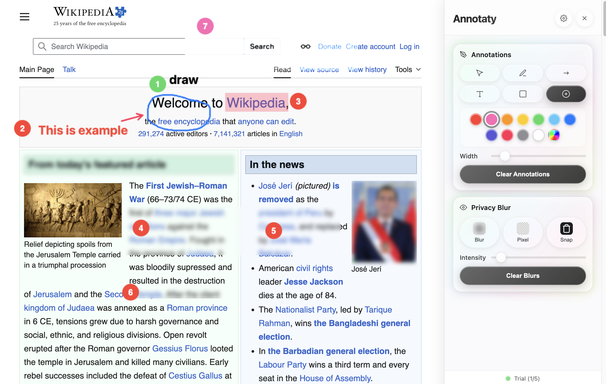

Annotaty Pro
The Ultimate Professional Annotation & Privacy Suite
Annotaty Pro is a high-performance browser extension developed by J. Taichi LABS. Designed for professionals, developers, and educators, it transforms your browser into a live canvas. Effortlessly draw, mark up, and obscure sensitive data in real-time—perfect for screen sharing, video tutorials, and technical reviews.

Core Features
🎨 Professional Drawing Suite: Create arrows, shapes, text boxes, and numbered step markers directly on any webpage.

🚫 Precision Privacy Blur: Instantly obscure sensitive info with Blur, Pixelate, or Blackout modes.

🎯 Snap-to-Element: One click to hide any distraction on the web. Work like "Hide distraction" on Safari.

🔒 Privacy-First: All processing happens locally in your browser. Your annotations and data never touch a server.

✨ Glassmorphic UI: A beautiful, non-intrusive sidebar that docks to your page without breaking the layout.

Pricing & Support
Annotaty offers a 5-use Free Trial of all premium tools. Unlock unlimited annotations, advanced shapes, and the exclusive "Glowing" theme with a one-time Pro upgrade.
